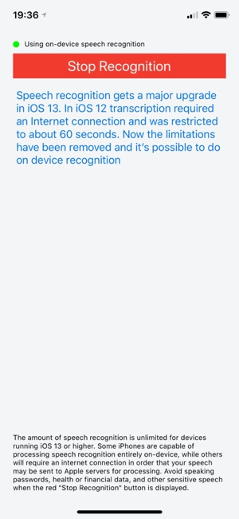

#  Speech Dictation Demo
## An iOS speech recognition demo that transcribes live speech

**Tested and working on iOS 13.1.2, Xcode 11.1 and iPhone XS**



___

This simple demo shows how straightforward it is to add live speech recognition and transcription to your apps.

The core of the app is in **SpeechRecognitionHelper.startDictation()** where we setup an audio recording session
and a speech **recognitionRequest**:

``` swift
fileprivate func startDictation() throws {
        
    let audioSession = AVAudioSession.sharedInstance()
    try audioSession.setCategory(.record, mode: .measurement, options: .duckOthers)
    try audioSession.setActive(true, options: .notifyOthersOnDeactivation)
    
    recognitionRequest = SFSpeechAudioBufferRecognitionRequest()
    guard recognitionRequest != nil else { return }
    
    recognitionRequest!.shouldReportPartialResults = true  // Results are returned before audio recording is finished
    :
```

I'd looked at Apple's speech recognition technology a couple of years ago for inclusion in one of my apps. 
However, the 60-second limitation seemed a bit *too* limiting for users wanting to make and transcribe audio notes.
It also required a round-trip to Apple servers to actually carry out the speech recognition. So, it wouldn't work
without an Internet connection.

With iOS 13 it appears those limitations have been removed:

* Speech recognition can be processed entirely on the device, with no data sent to Apple
* There is no limit to the amount (duration) of speech recognition, or the number of requests

``` swift
// New for iOS 13. Keep speech recognition data on device if possible (if it's supported)
if #available(iOS 13, *) {
    recognitionRequest!.requiresOnDeviceRecognition = speechRecognizer!.supportsOnDeviceRecognition
}
```

The speech **recognitionTask** passes chucks of recognized text to the result handler closure, which are then passed
onto the app's main **SpeechViewController** via a delegate call:

``` swift
recognitionTask = speechRecognizer!.recognitionTask(with: recognitionRequest!) { [unowned self] result, error in
    if error != nil { self.stopRecognition() }
    if let r = result {
        self.delegate?.recognitionTextUpdate(text: r.bestTranscription.formattedString, isFinal: r.isFinal)
    }
}
```
___

## References

* https://developer.apple.com/documentation/speech/recognizing_speech_in_live_audio
* https://nshipster.com/ios-13/
* https://www.hackingwithswift.com/example-code/libraries/how-to-convert-speech-to-text-using-sfspeechrecognizer

